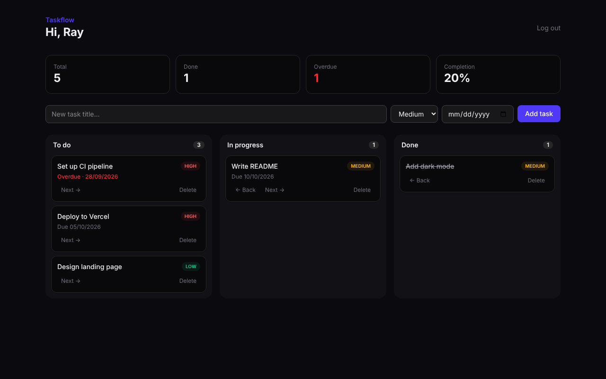

# Taskflow


A kanban task tracker with user accounts, priorities, due dates and progress stats.



**Live demo:** _add your deploy link here_

## Features

- Sign up and log in (bcrypt-hashed passwords, JWT session in an httpOnly cookie)
- Protected routes with Next.js middleware
- Three-column board: To do, In progress, Done
- Priorities and due dates, with overdue tasks highlighted
- Stats: total, done, overdue, completion %
- Server-side validation with Zod on every form
- Every query is scoped to the logged-in user, so nobody can edit someone else's tasks

## Tech stack

| Layer     | Tech                                          |
| --------- | --------------------------------------------- |
| Framework | Next.js 15 (App Router, Server Actions)       |
| Language  | TypeScript                                    |
| Database  | PostgreSQL + Drizzle ORM                      |
| Styling   | Tailwind CSS 4                                |
| Auth      | bcryptjs + jose (JWT)                         |
| Testing   | Vitest                                        |
| CI        | GitHub Actions (lint, typecheck, test, build) |
| Deploy    | Docker                                        |

## Run locally

Needs Node 22. No database setup needed: in dev the app uses PGlite, an embedded Postgres.

```bash
git clone https://github.com/raymanitis/taskflow.git
cd taskflow
cp .env.example .env        # then set SESSION_SECRET
npm install
npm run dev
```

Open http://localhost:3000.

To use a real Postgres server instead, start one with `docker compose up -d db` and uncomment `DATABASE_URL` in `.env`.

Or run everything in Docker:

```bash
docker compose --profile full up --build
```

## Scripts

| Command               | What it does                           |
| --------------------- | -------------------------------------- |
| `npm run dev`         | Start dev server                       |
| `npm test`            | Run unit tests                         |
| `npm run lint`        | ESLint                                 |
| `npm run typecheck`   | TypeScript check                       |
| `npm run db:generate` | Create a migration from schema changes |
| `npm run db:migrate`  | Apply migrations                       |

## Project structure

```
src/
  app/            routes, pages and server actions
  components/     UI components
  db/             Drizzle schema and migration runner
  lib/            auth, session, validation, task logic
  middleware.ts   route protection
tests/            unit tests
drizzle/          SQL migrations
```

## License

MIT
